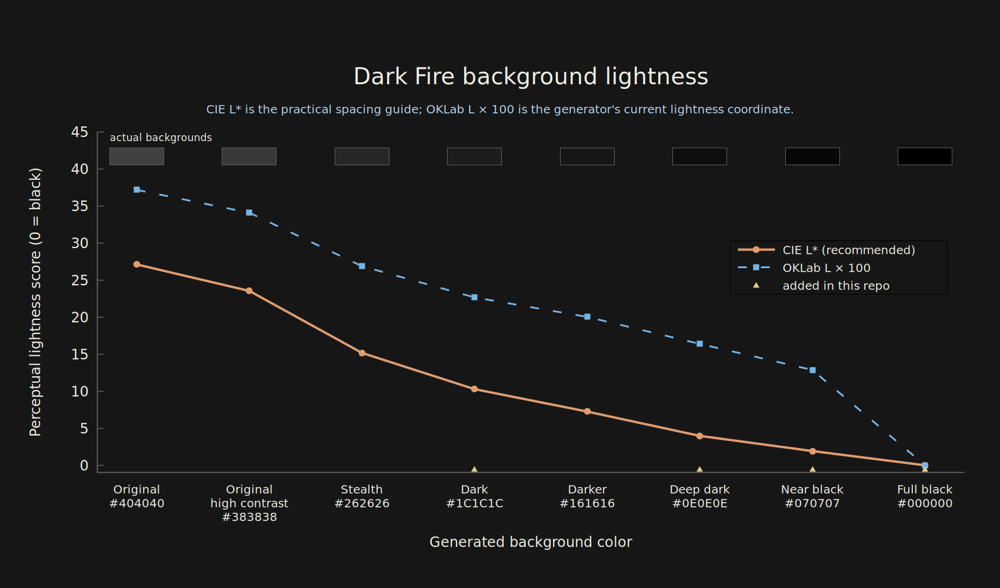

# Dark Fire

Dark Fire themes for VS Code, Ghostty, and the web, generated from one small Zig color engine.

Dark Fire is based on [matklad's Pale Fire](https://github.com/matklad/pale-fire), which is itself based on [Zenburn for Emacs](https://github.com/bbatsov/zenburn-emacs).

The palette and its variants live in one place. Each backend only maps those colors into its target format, making it straightforward to add more outputs later.

Try all eight variants in the [interactive preview](https://cgbur.com/dark-fire/), then read about the choices behind the project in [the accompanying post](https://cgbur.com/posts/dark-fire/).

One goal of this project is to make the darker end of the Pale Fire palette feel more deliberate across applications. The upstream themes leave some large perceptual jumps between backgrounds, while editor and terminal versions of a theme can feel noticeably different. Dark Fire adds more closely spaced dark options and generates every target from the same palette so VS Code, Ghostty, and the web stay visually aligned.

## Install

### VS Code

Download the `.vsix` file from the [latest release](https://github.com/cgbur/dark-fire/releases/latest). In VS Code, open the Command Palette, run **Extensions: Install from VSIX...**, and choose the downloaded file.

Then run **Preferences: Color Theme** and choose a Dark Fire variant. To update later, download and install the newer VSIX.

Marketplace publication is deferred and tracked in [the Marketplace issue](https://github.com/cgbur/dark-fire/issues/1).

### Ghostty

Download `dark-fire-ghostty-themes-*.zip` from the [latest release](https://github.com/cgbur/dark-fire/releases/latest) and extract it with your archive application. Copy the extracted files into Ghostty's theme directory:

```sh
mkdir -p "${XDG_CONFIG_HOME:-$HOME/.config}/ghostty/themes"
cp /path/to/extracted-themes/* "${XDG_CONFIG_HOME:-$HOME/.config}/ghostty/themes/"
```

Add a theme to `${XDG_CONFIG_HOME:-$HOME/.config}/ghostty/config.ghostty`:

```ini
theme = Dark Fire 07 - Near Black
```

Reload Ghostty's configuration or restart Ghostty. See the [Ghostty configuration documentation](https://ghostty.org/docs/config) for alternative config locations.

### Web

Download `dark-fire-web-themes-*.zip` from the [latest release](https://github.com/cgbur/dark-fire/releases/latest) and extract `dark-fire.css`. The stylesheet exposes every palette as CSS custom properties. Add a variant to any container without changing the rest of the page:

```html
<link rel="stylesheet" href="dark-fire.css" />

<article data-dark-fire-theme="near-black">
  <!-- Use --df-background, --df-foreground, and the other --df-* colors here. -->
</article>
```

## Variants

The names sort from lightest background to darkest:

| Variant | Editor background | Character |
| --- | --- | --- |
| Dark Fire 01 - Original | `#404040` | The original palette |
| Dark Fire 02 - Original High Contrast | `#383838` | The original palette with stronger contrast |
| Dark Fire 03 - Stealth | `#262626` | Muted contrast |
| Dark Fire 04 - Dark | `#1C1C1C` | A small step above Darker |
| Dark Fire 05 - Darker | `#161616` | Upstream's darker variant |
| Dark Fire 06 - Deep Dark | `#0E0E0E` | Between Darker and Near Black |
| Dark Fire 07 - Near Black | `#070707` | Almost black with subtle depth |
| Dark Fire 08 - Full Black | `#000000` | Black primary surfaces with visible borders |

### Perceptual background spacing

The plot compares the generated backgrounds using CIE L*, a practical perceived-lightness guide for neutral SDR colors, and the OKLab L coordinate used by the palette generator. Exact near-black perception still depends on the display, ambient light, and visual adaptation.



Regenerate the image from its [gnuplot source](./docs/assets/background-lightness.gnuplot):

```sh
nix develop --command gnuplot docs/assets/background-lightness.gnuplot
```

## Development

Run `direnv allow` to enter the Nix development shell automatically, or use `nix develop` directly. The shell provides Zig, Node.js, `jq`, `zip`, and gnuplot.

```sh
zig build run -- generate
zig build run -- check
zig build test
```

The generator writes every variant to `themes/vscode/` and `themes/ghostty/`, plus one portable stylesheet at `themes/web/dark-fire.css`. Generated themes and VSIX files are not committed; the Zig source is the source of truth.

List variants with `zig build run -- list`, or generate one with `zig build run -- generate --variant near-black`.

To package the VS Code themes locally:

```sh
npm ci
npm run package:vscode
```

The VS Code package is registered through `contributes.themes` in [`package.json`](./package.json) and needs no runtime extension code.

## Adding a backend

Keep palette decisions in [`src/palette.zig`](./src/palette.zig) and target-specific formatting in the backend. [`src/ghostty.zig`](./src/ghostty.zig) is the smallest example. A backend exposes:

```zig
pub fn render(allocator: std.mem.Allocator, variant: palette.Variant) ![]u8
```

The caller owns the returned buffer. Use `variant.palette` for colors and `variant.slug` or `variant.label` for names. Use `background()` and `surface()` for surfaces so the Full Black variant remains truly black.

To wire it in:

1. Import the backend in [`src/main.zig`](./src/main.zig) and create its `themes/<target>/` output directory.
2. Extend `processVariant` to render and either write or check the backend's file. Derive its filename from the slug or label, or add a field to `palette.Variant` when the target needs a special name.
3. Add a focused renderer test, then run:

```sh
zig fmt --check build.zig src
zig build test
zig build run -- generate
zig build run -- check
```

If the backend should be downloadable, also bundle `themes/<target>/` in [the release workflow](./.github/workflows/release.yml) and add its installation instructions here.

## License

GPLv3, like [the original Pale Fire](https://github.com/matklad/pale-fire). See [`LICENSE`](./LICENSE).
